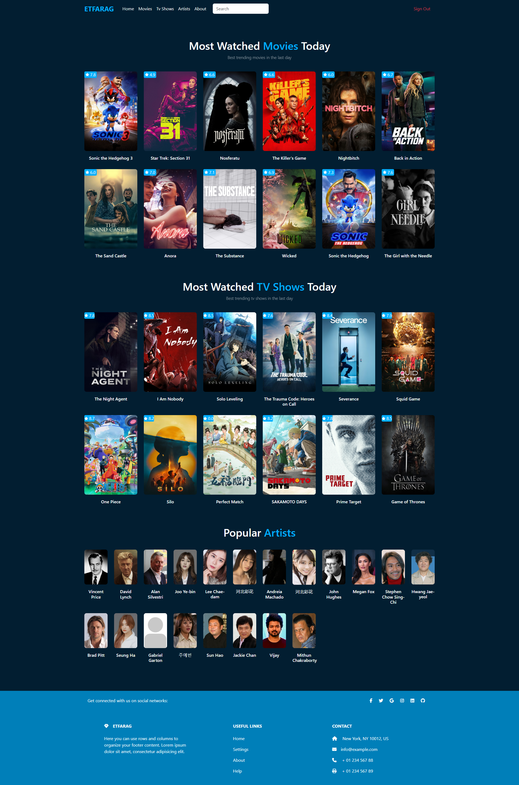
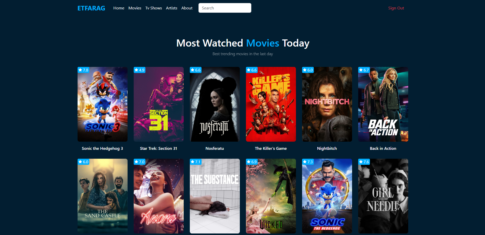
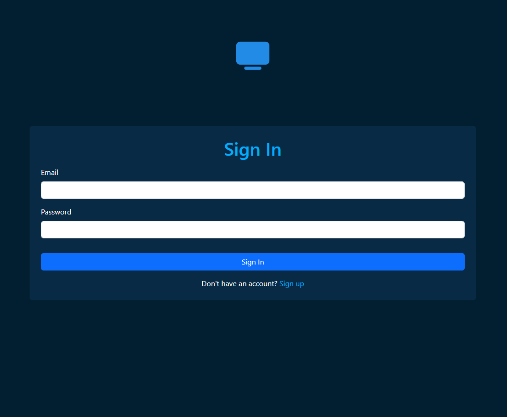

# 🖥️ Etfarag

Etfarag Now is a web platform designed for showcasing the latest movies and TV shows in a simple and visually appealing way. It provides users with a seamless experience to browse trending titles, view detailed information.

## 🌐 Live Demo

Check out the live demo of the project here:  
[Etfarag Now Live Demo](https://etfaragnow.vercel.app/)

---

## 🌟 **Features**
- ✅ Feature 1: User Authentication: Secure login and registration.
- ✅ Feature 2: Dynamic Navigation: Implemented with React Router DOM to ensure seamless page transitions.
- ✅ Feature 3: State Management: Powered by Context.
- ✅ Feature 4: Form Validation: Enhanced user input accuracy with Joi validation.
- ✅ Feature 5: API Integration: Smooth data fetching from TMDB APIs using Axios.

---

## 📸 **Screenshots**
Screenshots showcasing the website interface or key features:

- **Homepage:**
  

- **User Authentication:**
  

- **Form Validation:**
  

---

## 🛠️ **Technologies Used**
- CSS / JavaScript
- React.js
- Bootstrap
- React Router
- State Management (Context)
- Axios / Joi / JWT

